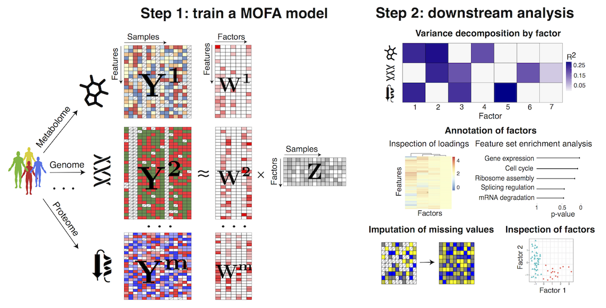
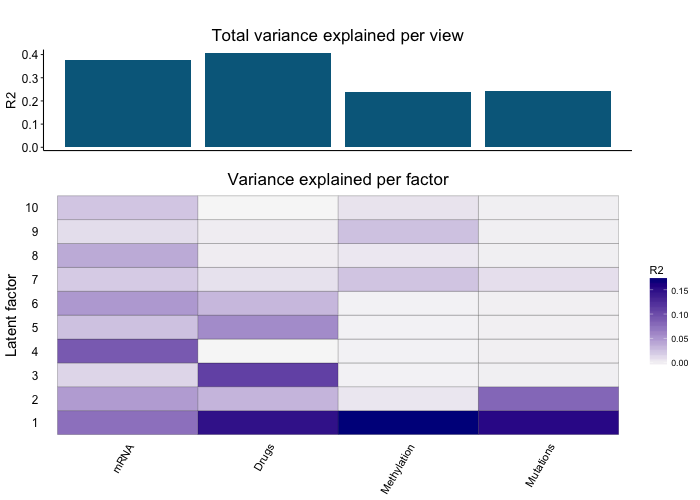

# MOFA: Multi-Omics Factor Analysis

MOFA is a factor analysis model that provides a **general framework for the integration of multi-omic data sets** in a completely unsupervised fashion.  
Intuitively, MOFA can be viewed as a versatile and statistically rigorous generalization of principal component analysis (PCA) to multi-omics data. Given several data matrices with measurements of multiple ‘omics data types on the same or on overlapping sets of samples, MOFA infers an **interpretable low-dimensional data representation in terms of (hidden) factors**. These learnt factors represent the driving sources of variation across data modalities, thus facilitating the identification of cellular states or disease subgroups.  

Once trained, the model output can be used for a range of downstream analyses, including the visualisation of samples in factor space, the automatic annotation of factors using (gene set) enrichment analysis, the identification of outliers (e.g. due to sample swaps) and the imputation of missing values.  

For more details you can read our paper: http://msb.embopress.org/cgi/doi/10.15252/msb.20178124
<p align="center"> 
​
</p>


## News
- 10/01/2019 Python package uploaded to PyPy
- 21/06/2018 Beta version released
- 20/06/2018 Paper published: http://msb.embopress.org/content/14/6/e8124
- 10/11/2017 We created a Slack group to provide personalised help on running and interpreting MOFA, [this is the link](https://join.slack.com/t/mofahelp/shared_invite/enQtMjcxNzM3OTE3NjcxLTkyZmE5YzNiMDc4OTkxYWExYWNlZTRhMWI2OWNkNzhmYmNlZjJiMjA4MjNiYjI2YTc4NjExNzU2ZTZiYzQyNjY)
 

## Installation
MOFA is run exclusively from R, but it requires some python dependencies that you need to install. Here is how to do it:

### MOFA R package
The easier way to install the R package is via github:
```r
devtools::install_github("bioFAM/MOFA", build_opts = c("--no-resave-data"))
```

### MOFAdata R data package
For illustration purposes we provide several data sets that are used in the vignettes of the MOFA package to illustrate the use of MOFA. This data is contained in the R package MOFAdata, which can be installed via:
```r
devtools::install_github("bioFAM/MOFAdata", build_opts = c("--no-resave-data"))
```

### Python dependencies 
After installing the MOFA R package, you can install the `mofapy` python package in two ways:

Using pip (from the terminal)
```r
pip install mofapy
```

From R itself, the connection with Python is made via the `reticulate` package:
```r
library(reticulate)

# DEFAULT: if you are not familiar with conda or virtual environments, just try the following:
# 	On Linux and OS X the "virtualenv" method will be used by default.
# 	On Windows, the "conda" method is always used.
py_install("mofapy", envname = "r-reticulate", method="auto")

# Use the conda environment "r-reticulate"
py_install("mofapy", envname = "r-reticulate", method = "conda", pip = TRUE, pip_ignore_installed = TRUE)

# Use the virtual environment "r-reticulate"
py_install("mofapy", envname = "r-reticulate", method = "virtualenv")

```

## Reticulate configuration

Before running MOFA, you need to make sure that `reticulate` is pointing to the correct python binary or conda environment.  
This can become tricky when you have multiple conda environments and versions of Python installed:
```r
library(reticulate)

# Using a specific python binary
use_python("/home/user/python", required = TRUE)

# Using a conda enviroment called "r-reticulate"
use_condaenv("r-reticulate", required = TRUE)

# Using a virtual environment called "r-reticulate"
use_virtualenv("r-reticulate", required = TRUE)
```

For more details on how to set up the reticulate connection, see: https://rstudio.github.io/reticulate/

## Tutorials/Vignettes
We currently provide three example workflows:

* **Integration of multi-omics cancer data** (`vignette("MOFA_example_CLL")`): a cohort of 200 chronic lymphocytic leukaemia patients. This is the main data set analysed in the [paper](http://msb.embopress.org/cgi/doi/10.15252/msb.20178124).
* **Integration of single-cell multi-omics data** (`vignette("MOFA_example_scMT")`): single-cell profiling of DNA methylation and RNA expression in roughly 100 pluripotent stem cells.
* **Model selection and robustness with simulated data** (`vignette("MOFA_example_simulated")`): this tutorial is focused only on how to perform model selection and assess robustness.

If there is any tutorial that you would like us to do, or if you want to share your analysis with MOFA, please contact us.


## MOFA workflow

The workflow of MOFA consists of two steps:  
**(1) Fitting step**: train the model with the multi-omics data to disentangle the heterogeneity into a small number of latent factors.  
**(2) Downstream analysis**: once the factors are inferred they need to be characterised as technical or biological sources of variation by looking at the corresponding weights, doing (gene set) enrichment analysis, plotting the factors, correlating factors with known covariates, etc. Also, one can do imputation of missing values and prediction of clinical outcomes using the latent factors.

<p align="center"> 

</p>

A list with all **relevant methods**, together with a short description, can be found in the introductory vignette of the R package (`vignette("MOFA")`).

### Step 1: Fitting the model
First you need to create the MOFA object with your input data, and subsequently you need to train the model. Everything is explained in the vignettes.  
If everything is successful, you should observe an output analogous to the following:
```
  ###########################################################
  ###                 __  __  ___  _____ _                ###
  ###                |  \/  |/ _ \|  ___/ \               ###
  ###                | |\/| | | | | |_ / _ \              ###
  ###                | |  | | |_| |  _/ ___ \             ###
  ###                |_|  |_|\___/|_|/_/   \_\            ###
  ###                                                     ###
  ###########################################################

##################
## Loading data ##
##################

Loaded /Users/ricard/MOFA/MOFA/test/data/500_0.txt with dim (100,500)...
Loaded /Users/ricard/MOFA/MOFA/test/data/500_1.txt with dim (100,500)...
Loaded /Users/ricard/MOFA/MOFA/test/data/500_2.txt with dim (100,500)...
 

#############################################
## Running trial number 1 with seed 642034 ##
#############################################

Trial 1, Iteration 1: time=0.08 ELBO=-345954.96, Factors=10, Covariates=1
Trial 1, Iteration 2: time=0.10 ELBO=-283729.31, deltaELBO=62225.6421, Factors=10
Trial 1, Iteration 3: time=0.10 ELBO=-257427.42, deltaELBO=26301.8893, Factors=10
...
Trial 1, Iteration 100: time=0.07 ELBO=-221171.01, deltaELBO=0.0998, Factors=10

Converged!
```

There are two important quantities to keep track of: 
* **Number of factors**: you can choose whether to fix the number or factors or let the model automatically learn the dimensionality of the latent space.
* **deltaELBO**: this is the convergence statistic. Once the deltaELBO decreases below a threshold (close to zero), training will end and the model will be saved as an .hdf5 file. Then, you are ready to start the downstream analysis.

### Step 2: Downstream analysis: disentangle the variability between omics
MOFA disentangles the heterogeneity of a high-dimensional multi-omics data set into a set of latent factors that capture global sources of variation.  
Importantly, these factors can have different activity patterns in different omics. For example, a batch effect might be affecting the RNA data but not the Methylation data. 
Decoupling this heterogeneity is a mandatory first step in the analysis of multi-omics data. For example, this is the variance decomposition plot for the Chronic Lymphocytic Leukemia data set analysed in the paper:

<p align="center"> 
​
</p>


### Step 3: Annotation of factors
Once the heterogeneity of the data set is reduced into a set of factors, you need to understand what are they, and whether they capture technical or biological sources of variability. 

We have built a semi-automated pipeline based on our experience annotating factors:  
(1) **Visualisation of the samples in the factor space**: similarly to what is done in Principal Component Analysis, it is useful to plot the factors against each other and color the samples using known covariates such as batch, sex, clinical information, etc.  
(2) **Inspection of top weighted features**: for example, if a factor is associated to the sex of the individual, the mRNA data will have very high loadings for genes located in the X and Y chromosomes.  
(3) **Feature set enrichment analysis**: particularly when having large amounts of features, the inspection of loadings is challenging, and doing gene ontology enrichment analysis can be useful.  

Please refer to the vignettes or the paper for details on the different analysis.  

### Step 4: Using the factors to get biological insights in downstream analysis
The latent factors can be used for several purposes, such as:  
(1) **Dimensionality reduction**: similar to PCA, dimensionality reduction visualisations can be obtained by plotting the Factors against each other.  
(2) **Imputation**: Factors can be used to predict missing values, including entire missing assays.  
(3) **Predicting clinical response**: if the factors capture phenotypical information, they can capture clinical covariates of interest.  
(4) **Regressing out technical effects**: if a factor is capturing an undesired technical effect, its effect can be regressed out from your original data matrix.  

Please refer to the vignettes or the paper for details on the different analysis.  

## Frequently asked questions

**(Q) How do I normalise the data?**  
Always try to remove any technical source of variability before fitting the model.  
For example, for count-based data such as RNA-seq or ATAC-seq we recommend size factor normalisation + variance stabilisation. For microarray DNA methylation data, make sure that samples have no differences in the average intensity.  
If this is not done correctly, the model will learn a very strong Factor 1 that will capture this variability, and more subtle sources of variation will be harder to identify.  
We have implemented a function called `regressCovariates` that allows the user to regress out a covariate using a simple linear models. See the documentation and the CLL vignette for examples.

**(Q) I get the following error when installing the R package:**  
```
ERROR: dependencies 'pcaMethods', 'MultiAssayExperiment' are not available for package 'MOFA'
```
These two packages are available from Bioconductor, not CRAN. You can install them from R as follows:
```
source("https://bioconductor.org/biocLite.R")
biocLite(c('pcaMethods', 'MultiAssayExperiment'))
```

**(Q) I get one of the following errors when running MOFA:**  
```
AttributeError: 'module' object has no attribute 'core.entry_point

Error in py_module_import(module, convert = convert) :
 ModuleNotFoundError: No module named 'mofapy'
```
First thing: restart R and try again. If the error still holds, this means that either:  
(1) you did not install the mofa Python package (see instructions above).
(2) you have multiple python installations and R is not detecting the correct one where mofa is installed. You need to find out the right Python interpreter, which usually will be the one you get when running `which python` in the terminal. You can test if the mofa packaged is installed by running INSIDE python: `import mofapy`.  
Once everything is figured out, specify the following at the beginning of your R script:
```
library(reticulate)
use_python("YOUR_PYTHON_PATH", required=TRUE)
```
You can also use `use_conda` instead of `use_python` if you work with conda environments. Read more about the [reticulate](https://rstudio.github.io/reticulate/) package and [how it integrates Python and R](https://rstudio.github.io/reticulate/articles/versions.html)

**(Q) I hate R, can I do MOFA only with Python?**  
Nop. You can use Python to train the model, see [this template script](https://github.com/bioFAM/MOFA/blob/master/mofapy/run/python_template.py). However, we currently do not provide downstream analysis functions in Python. We strongly recommend that you use our MOFA R package for this.

**(Q) How many factors should I use?**  
Similar to Principal Component Analysis and other latent variable models, this is a hard question to answer. It depends on the data set and the aim of the analysis. As a general rule, the bigger the data set, the higher the number of factors that you will retrieve, and the less the variance that will be explained per factor.  
If you want to get an overview on the major sources of variability then use a small number of factors (K<=15). If you want to capture small sources of variability, for example to do imputation or eQTL mapping, then go for a large number of factors (K>25).

**(Q) How many samples do I need?**  
At least more than 15. Otherwise the model will not generate meaningful results.

**(Q) Can MOFA automatically learn the number of factors?**  
Yes, but the user needs to specify a minimum value of % variance explained. Then, MOFA will actively remove factors (during training) that explain less than the specified amount of variance.
If you have no idea on what to expect, it is better to start with a fixed number of factors and set the % variance threshold to 0.

**(Q) Can I put known covariates in the model?**  
Combining known covariates with latent factors is technically possible, but we extensively tested this functionality and it was not yielding good results. The reason is that covariates are usually discrete labels that do not reflect the underlying molecular biology. For example, if you introduce age as a covariate, but the actual age is different from the “molecular age”, the model will simply learn a new factor that corresponds to this “latent” molecular age, and it will drop the covariate from the model.  
We recommend that you learn the factors in a completely unsupervised manner and then relate them to the biological covariates via visualisation or via a simple correlation analysis (see our vignettes). If your covariate of interest is indeed an important driver of variability, do not worry, MOFA will find it! 

**(Q) Should I remove undesired sources of variability (i.e. batch effects) before fitting the model?**  
Yes, if you have clear technical factors, we strongly encourage to regress it out a priori using a simple linear model. The reason for this is that the model will "focus" on the huge variability driven by the technical factors, and smaller sources of variability could be missed.
You can regress out known covaraites using the function `regressCovariates`. See the corresponding documentation and the CLL vignette for details.

**(Q) Should I do any filtering to the input data?**  
You must remove features with zero variance and ideally also features with low variance, as they can cause numerical issues in the model. In practice we generally select the top N most variable features per assay

**(Q) My data sets have different dimensionalities, does this matter?**  
Yes, this is important. Bigger data modalities will tend to be overrepresent in the MOFA model. It is good practice to filter features (based for example on variance, as lowly variable features provide little information) in order to have the different dimensionalities within the same order of magnitudes. If this is unavoidable, take into account that the model has the risk of missing (small) sources of variation unique to the small data set.

**(Q) The weights have different values between runs. Is this expected?**  
This is normal and it happens because of to two reasons. The first one is that the model does not always converge to the same exact solution (see below in the FAQ), although different model instances should be pretty similar. The second reason is that factor analysis models are rotation invariant. This means that you can rotate your factors and your weights and still find the same solution. This implies that the signs of the weight or the factors can NOT be compared across trials, only within a trial.

**(Q) What data modalities can MOFA cope with?**  
* Continuous data: should be modelled using a gaussian likelihood. For example, log normalised RNA-seq data or M-values of bulk methylation data
* Binary data: should be modelled using a bernoulli likelihood. For example, somatic mutations or single-cell methylation data.
* Count data: should be modelled using a poisson likelihood. For example, copy number variation or scRNA-seq UMI data.
The use of non-gaussian likelihoods require further approximations and are not as accurate as the gaussian likelihood. Hence, if your data can be safely transformed to match the gaussian likelihood assumptions, this is always recommended. For example log-transform and variance stabilisation of bulk RNA-seq data or M-value computation in DNA methylation data.

**(Q) How do I assess convergence?**  
MOFA is trained using variational bayes, a fast inference framework that consists on optimising a statistica called the Evidence Lower Bound (ELBO). The model uses the change in ELBO (deltaELBO) to assess convergence. A model is defined to be converged when deltaELBO is close to 0. For a quick exploratory analysis, we suggest a convergence threshold between 1 to 10.

**(Q) The model does not converge smoothly, and it oscillates between positive and negative deltaELBO values**  
First, check that you are using the right likelihood model (see above). Second, make sure that you have no features or samples that are full of missing values. Third, check that you have no features with zero (or very little) variance. If the problem does not disappear, please contact us via mail or the Slack group, we will provide (quick!) help.

**(Q) What input formats are allowed?**  
The data has to be input in two possible formats: 
* Bioconductor approach: a [MultiAssayExperiment](https://bioconductor.org/packages/release/bioc/html/MultiAssayExperiment.html) object
* Base R approach: a list of matrices where features are rows and samples are columns.
Examples of both are shown in the vignettes.

**(Q) Does MOFA always converge to the same solutions?**  
No, as occurs in most complex Bayesian models, they are not guaranteed to always converge to the same (optimal) solution.
In practice, however, we observed that the solutions are highly consistent, particularly for strong factors. However, one should always assess the robustness and do a proper model selection. For this we recommend to train the model multiple times and check the robustness of the factors across the different solutions. For downstream analysis a single model can be chosen based on the best value of the Evidence Lower Bound (ELBO). We provide functions for these two steps, which are explained in the vignette *Integration of simulated data* (`vignette("MOFA_example_simulated")`).

**(Q) How does MOFA handle missing values?**  
It simpy ignores them, there is no a priori imputation step required. In fact, matrix factorisation models are known to be very robust to the presence of large amounts of missing values. 

**(Q) How can I do Gene Set Enrichment Analysis?**  
First, you need to create your binary gene set matrix where rows are feature sets and columns are features (genes). We have manually processed some of Reactome and MSigDB gene sets for mouse and human. Contact us if you would like to use the data.  
Then, you will have to choose a local statistic per feature (the loading, by default), a global statistic per pathway (average loading, by default), and a statistical test. The most trustworthy one is a permutation test with a long number of iterations, but this is slow and a fast parametric tests is also available. However, note that it tends to inflate the p-values due to the correlation structure between related genes (see for example [Gatti2010](https://bmcgenomics.biomedcentral.com/articles/10.1186/1471-2164-11-574)).


## Contact
The package is maintained by Ricard Argelaguet (ricard@ebi.ac.uk) and Britta Velten (britta.velten@embl.de). Please, reach us for problems, comments or suggestions. You can also contact us via a Slack group where we provide quick and personalised help, [this is the link](https://join.slack.com/t/mofahelp/shared_invite/enQtMjcxNzM3OTE3NjcxLTkyZmE5YzNiMDc4OTkxYWExYWNlZTRhMWI2OWNkNzhmYmNlZjJiMjA4MjNiYjI2YTc4NjExNzU2ZTZiYzQyNjY).  


